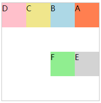
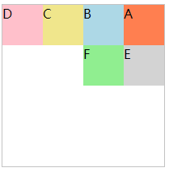

# flex

flex即为常说的弹性布局，是css3的新特性，任何一个容器都可以指定为flex布局

采用flex布局的元素，称为flex容器，简称容器。它的所有子元素自动成为容器成员，称为 Flex 项目（flex item），简称"项目"。所以一旦提到flex，就应该想到两个概念分别是容器和项目

## 容器的属性

以下6个属性设置在容器上。

 - flex-direction
 - flex-wrap
 - flex-flow
 - justify-content
 - align-items
 - align-content

### flex-direction

`flex-direction`属性决定主轴的方向（即项目的**排列方向**）。

```css
.box {
  flex-direction: row | row-reverse | column | column-reverse;
}
```

它可能有4个值。

- `row`（默认值）：主轴为水平方向，起点在左端。

- `row-reverse`：主轴为水平方向，起点在右端。

- `column`：主轴为垂直方向，起点在上沿。

- `column-reverse`：主轴为垂直方向，起点在下沿。

### flex-wrap属性

默认情况下，项目都排在一条线（又称"轴线"）上。`flex-wrap`属性定义，如果一条轴线排不下，**如何换行**。

```css
.box{
  flex-wrap: nowrap | wrap | wrap-reverse;
}
```

它可能有3个值。

- `nowrap`（默认）：不换行。如果挤不下，压缩
- `wrap`：换行，第一行在上方。
- `wrap-reverse`：换行，第一行在下方。

### flex-flow

`flex-flow`属性是`flex-direction`属性和`flex-wrap`属性的简写形式，默认值为`row nowrap`。

```css
.box {
  flex-flow: <flex-direction> || <flex-wrap>;
}
```

### justify-content

`justify-content`属性定义了项目在主轴上的对齐方式。也有一种说法叫富裕空间管理


它可能取5个值，具体对齐方式与轴的方向有关。下面假设主轴为从左到右。

- `flex-start`（默认值）：左对齐
- `flex-end`：右对齐
- `center`： 居中
- `space-between`：两端对齐，项目之间的间隔都相等。
- `space-around`：每个项目两侧的间隔相等。所以，项目之间的间隔比项目与边框的间隔大一倍。

###  align-items

`align-items`属性定义项目在侧轴上如何对齐。（主轴侧轴是一个相对概念，`flex-direction`决定了主轴和侧轴的方向，不是说横向一定就是主轴，纵向一定是侧轴）

```css
.box {
  align-items: flex-start | flex-end | center | baseline | stretch;
}
```


它可能取5个值。具体的对齐方式与侧轴的方向有关，下面假设侧轴从上到下。

 - `flex-start`：交叉轴的起点对齐。
 - `flex-end`：交叉轴的终点对齐。
 - `center`：交叉轴的中点对齐。
 - `baseline`: 项目的第一行文字的基线对齐。
 - `stretch`（默认值）：如果项目未设置高度或设为auto，将占满整个容器的高度。

###  align-content属性

`align-content`属性定义了多根轴线的对齐方式。如果项目只有一根轴线，该属性不起作用。

```css
.box {
  align-content: flex-start | flex-end | center | space-between | space-around | stretch;
}
```


该属性可能取6个值。

 - `flex-start`：与交叉轴的起点对齐。
 - `flex-end`：与交叉轴的终点对齐。
 - `center`：与交叉轴的中点对齐。
 - `space-between`：与交叉轴两端对齐，轴线之间的间隔平均分布。
 - `space-around`：每根轴线两侧的间隔都相等。所以，轴线之间的间隔比轴线与边框的间隔大一倍。
 - `stretch`（默认值）：轴线占满整个交叉轴。

### align-items和align-content的区别

`align-items`和`justify-content`是相对的概念，分别是主轴和侧轴的富裕空间管理，而align-content是一个基于多轴的概念，比如`flex-wrap`设置为`wrap`时。

具体的应用如下，容器和项目的css如下

```css
#main {
  width: 200px;
  height: 200px;
  border: 1px solid #c3c3c3;
  display: -webkit-flex; /* Safari */
  -webkit-flex-flow: row-reverse wrap; /* Safari 6.1+ */
  display: flex;
  flex-flow: row-reverse wrap;
}

#main div {
  width: 50px;
  height: 50px;
}
```

显示效果如图所示



从图中可以看出，行与行之间有明显的空白部分，如果这时候设置`align-item`属性是没有办法消去行间的空白的，这就属于`align-content`属性控制的内容

只需要将`align-content`属性设置为`flex-start`即可



## 项目的属性

以下6个属性设置在项目上。

 - `order`
 - `flex-grow`
 - `flex-shrink`
 - `flex-basis`
 - `flex`
 - `align-self`

### order属性

`order`属性定义项目的排列顺序。数值越小，排列越靠前，默认为0。

```css
.item {
  order: <integer>;
}
```

也就说`order`属性会改变项目原来的默认顺讯

### flex-grow属性

`flex-grow`属性定义项目的放大比例，默认为`0`，即如果存在剩余空间，也不放大。

```css
.item {
  flex-grow: <number>; /* default 0 */
}
```

### flex-shrink属性

`flex-shrink`属性定义了项目的缩小比例，默认为1，即如果空间不足，该项目将缩小。

```css
.item {
  flex-shrink: <number>; /* default 1 */
}
```


如果所有项目的`flex-shrink`属性都为1，当空间不足时，都将等比例缩小。如果一个项目的`flex-shrink`属性为0，其他项目都为1，则空间不足时，前者不缩小。

负值对该属性无效。

### flex-basis属性

`flex-basis`属性定义了在分配多余空间之前，项目占据的主轴空间（main size）。浏览器根据这个属性，计算主轴是否有多余空间。它的默认值为`auto`，即项目的本来大小。

它可以设为跟`width`或`height`属性一样的值（比如350px），则项目将占据固定空间。

`flex-basis`这个属性在于它可以弹一弹，如果只设置了width，当项目的宽度被内容撑开超过了`width`，项目的宽度不会改变，但是如果设置了`flex-basis`属性，那么它就可以被撑开，**需要注意的是**，`width`优先级高于`flex-basis`

### flex属性

`flex`属性是`flex-grow`, `flex-shrink` 和 `flex-basis`的简写，默认值为`0 1 auto`。后两个属性可选。

```css
.item {
  flex: none | [ <'flex-grow'> <'flex-shrink'>? || <'flex-basis'> ]
}
```

该属性有两个快捷值：`auto` (`1 1 auto`) 和 none (`0 0 auto`)。

建议优先使用这个属性，而不是单独写三个分离的属性，因为浏览器会推算相关值。

### align-self属性

`align-self`属性允许单个项目有与其他项目不一样的对齐方式，可覆盖`align-items`属性。默认值为`auto`，表示继承父元素的`align-items`属性，如果没有父元素，则等同于`stretch`。

```css
.item {
  align-self: auto | flex-start | flex-end | center | baseline | stretch;
}
```


该属性可能取6个值，除了auto，其他都与align-items属性完全一致。
